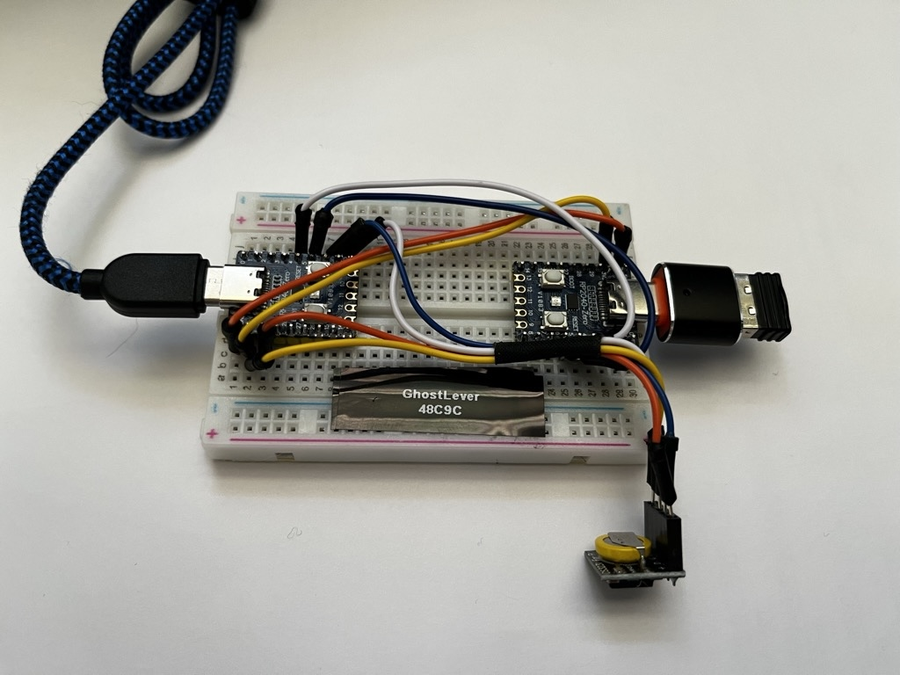

<h1 align="center">
  
</h1>

GhostLever is a USB device for locked-down corporate PCs
where installing software, browser extensions, drivers, or background
services is blocked. Built around two RP2040 boards, it sits between a USB input
device and a computer, listening for trigger text and types expansions when it detects it.
It is like a cross between a macro keypad and text-expansion software with a real time clock
to allow generating date functions. 

Configuration is handled by the browser-based GhostLever configurator in this
repository. Rules are saved on the primary board, so they continue to work
after the configurator is disconnected.

> Breadboard prototype: the computer-facing primary RP2040 is on the left, the
> USB-host bridge is on the right, and the DS3231 real-time clock module is at
> the bottom. Jumper colors are only illustrative—follow the pin table below.

## Why a hardware solution?

GhostLever presents itself to the computer as a standard USB HID
keyboard. Its rules run on the hardware, not on the corporate PC. A device can 
therefore be configured on a permitted system and then provide approved keyboard 
automation without an installed application or background process on the managed 
workstation.

This design is intended for authorized productivity and accessibility
workflows. It does not override endpoint controls, and an organization may
restrict external HID devices. Obtain approval from the employer or IT/security
team before connecting GhostLever to a managed computer, and do not store
passwords, access tokens, or other secrets in expansion rules.

## Features

- Typed triggers that expand into reusable text or multi-step actions
- Configurable actions for a 19-key numeric keypad
- Keyboard shortcuts and inline HID key combinations
- Date, time, and custom placeholders backed by a DS3231 real-time clock
- Pass-through for unassigned keyboard/keypad input
- Consumer-control media keys and standard mouse pass-through
- Browser configuration over USB serial using Chrome or Edge
- Up to 128 active rules within the 32 KB configuration limit

## Hardware

The pictured two-board build uses:

- Two RP2040-Zero-compatible boards
- One DS3231 real-time clock module
- One breadboard and jumper wires
- One USB host/OTG adapter that supplies VBUS to the attached input device
- USB cables for the computer and input-device connections
- A USB keyboard, keypad, mouse, or compatible receiver

## Wiring

### Primary board to USB-host bridge

| Primary board | Bridge board | Purpose |
| --- | --- | --- |
| GPIO4 (TX) | GPIO5 (RX) | UART data to bridge |
| GPIO5 (RX) | GPIO4 (TX) | UART data from bridge |
| GND | GND | Common ground |
| Native USB-C | Computer | USB HID and configurator connection |
| — | Native USB-C | USB host connection to the input device |

The bridge USB-C connector is the downstream host port. Use an OTG/host
connection that provides VBUS to the keyboard, keypad, mouse, or receiver.

### Primary board to DS3231

| Primary board | DS3231 | Purpose |
| --- | --- | --- |
| GPIO6 | SDA | I2C data |
| GPIO7 | SCL | I2C clock |
| 3V3 | VCC | RTC power |
| GND | GND | RTC ground |

Use 3.3 V for the RTC module so any onboard I2C pull-ups do not raise the
RP2040 GPIO lines above their safe voltage.

## Firmware setup

The Arduino environment requires:

- Raspberry Pi Pico/RP2040 board package
- Adafruit TinyUSB Library
- Adafruit NeoPixel
- Pico-PIO-USB
- ArduinoJson 7

### 1. Flash the bridge board

Open [`firmware/UsbUart_Bridge/UsbUart_Bridge.ino`](firmware/UsbUart_Bridge/UsbUart_Bridge.ino)
and flash it to the RP2040 board connected to the input device. Select
**Adafruit TinyUSB Host (native)** as the USB stack.

### 2. Flash the primary board

Open [`firmware/RTC_Setup/RTC_Setup.ino`](firmware/RTC_Setup/RTC_Setup.ino) and
flash it to the computer-facing RP2040 board. The current firmware is verified
with these settings:

- Board profile: Seeed XIAO RP2040
- USB stack: Adafruit TinyUSB
- Flash size: 2 MB with a LittleFS partition (256 KB recommended)
- CPU speed: 240 MHz

The 240 MHz setting is an RP2040 overclock used by the PIO USB fallback path;
qualify it on the specific hardware before relying on the device in a critical
workflow.

### 3. Configure GhostLever

1. Open [`index.html`](index.html) from an HTTPS site or serve the repository on
   `localhost`.
2. Use Chrome or Edge and select **Connect Device**.
3. Choose the GhostLever serial port.
4. Create typed expansions or keypad actions, then write the configuration to
   the device.
5. Use the Date/Time page to synchronize the DS3231 clock when needed.

Web Serial requires a secure context, so opening `index.html` directly as a
local file may not provide device access.

## Status LED

The onboard RGB LED reports the general device state:

- **Red:** initialization failed or no active input path
- **Blue:** USB host is ready and waiting for an input device
- **Green:** an input device is connected and active

## Repository layout

| Path | Contents |
| --- | --- |
| [`index.html`](index.html) | GhostLever browser configurator |
| [`firmware/RTC_Setup`](firmware/RTC_Setup) | Primary device firmware and detailed behavior |
| [`firmware/UsbUart_Bridge`](firmware/UsbUart_Bridge) | USB-host bridge firmware |
| [`firmware/third_party/Pico_PIO_USB`](firmware/third_party/Pico_PIO_USB) | Vendored PIO USB dependency and project patch notes |
| [`expansion-sets`](expansion-sets) | Installable shared expansion sets |
| [`tools`](tools) | Serial and stability diagnostics |

For lower-level firmware behavior, protocol details, and the original
single-board PIO USB wiring, see the
[`RTC_Setup` firmware notes](firmware/RTC_Setup/README.md).
